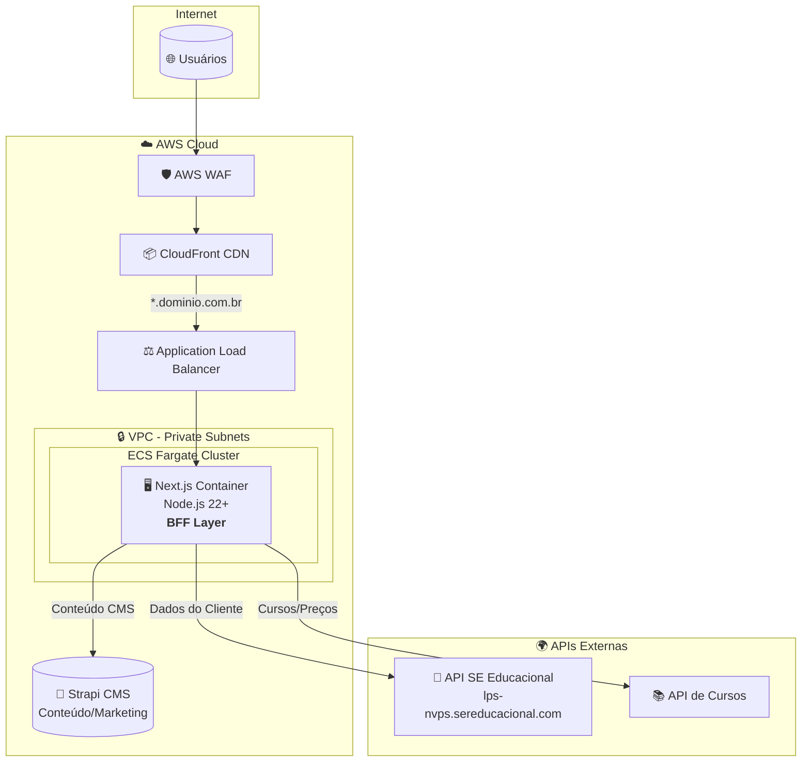
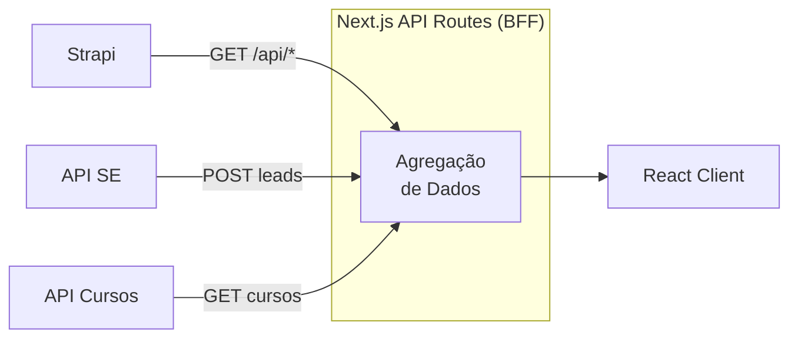
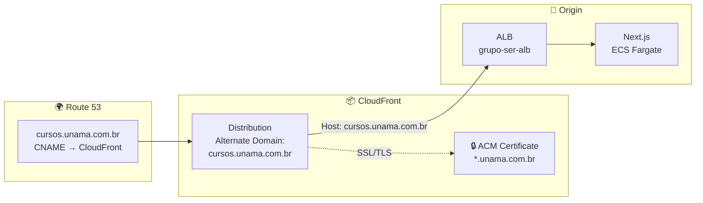

# Grupo SER - Frontend (Next.js)

Aplicação frontend construída com **Next.js 16** e **React 19**.

## 🏗️ Arquitetura de Infraestrutura AWS



## 📊 Fluxo de Dados (BFF Pattern)

O Next.js atua como **BFF (Backend for Frontend)**, agregando dados de múltiplas fontes:

| Fonte                  | Dados                      | Uso                    |
| ---------------------- | -------------------------- | ---------------------- |
| **Strapi CMS**         | Banners, FAQs, Textos, SEO | Páginas institucionais |
| **API SE Educacional** | Leads, Formulários         | Captação de alunos     |
| **API de Cursos**      | Cursos, Preços, Campus     | Listagem e busca       |



## 🌐 Arquitetura de Domínio (V1)

Na V1, o site será acessado via **cursos.unama.com.br** (em vez de `www.dominio.com/unama`):



### Configuração de Domínio

| Componente     | Configuração                       | Descrição                                |
| -------------- | ---------------------------------- | ---------------------------------------- |
| **Route 53**   | `cursos.unama.com.br` → CloudFront | CNAME ou Alias Record                    |
| **ACM**        | `*.unama.com.br`                   | Certificado wildcard na região us-east-1 |
| **CloudFront** | Alternate Domain Name              | `cursos.unama.com.br`                    |
| **ALB**        | Host Header                        | Recebe requisições do CloudFront         |

> [!NOTE]
> O certificado ACM **deve** estar na região `us-east-1` para uso com CloudFront.

## 📋 Requisitos de Infraestrutura

| Recurso               | Configuração            | Descrição                           |
| --------------------- | ----------------------- | ----------------------------------- |
| **Container Runtime** | Docker                  | Imagem baseada em Node.js 22 Alpine |
| **Porta**             | `3000`                  | Porta exposta pelo Next.js          |
| **Memória**           | 512MB - 1GB             | Recomendado para produção           |
| **CPU**               | 0.25 - 0.5 vCPU         | Escalável conforme demanda          |
| **Health Check**      | `GET /api/health-check` | Endpoint para verificação de saúde  |

## 🔧 Variáveis de Ambiente

### Obrigatórias

| Variável               | Descrição                                                 |
| ---------------------- | --------------------------------------------------------- |
| `NODE_ENV`             | `production`                                              |
| `STRAPI_URL`           | URL interna do Strapi (ex: `http://strapi.internal:1337`) |
| `STRAPI_TOKEN`         | Token de API do Strapi                                    |
| `API_BASE_URL`         | URL da API SE Educacional                                 |
| `COURSES_API_BASE_URL` | URL da API de Cursos                                      |

### Opcionais / Públicas

| Variável                         | Descrição                           |
| -------------------------------- | ----------------------------------- |
| `NEXT_PUBLIC_STRAPI_URL`         | URL pública do Strapi (para assets) |
| `NEXT_PUBLIC_RECAPTCHA_SITE_KEY` | Chave do Google reCAPTCHA v3        |
| `REVALIDATION_SECRET`            | Token para ISR on-demand            |
| `CDN_URL`                        | URL do CloudFront para assets       |

## 🐳 Build Docker

```bash
# Build da imagem
docker build -t grupo-ser-next .

# Executar localmente
docker run -p 3000:3000 \
  -e STRAPI_URL=http://localhost:1337 \
  -e API_BASE_URL=https://lps-nvps.sereducacional.com \
  grupo-ser-next
```

## 📦 Serviços AWS Necessários

1. **ECR** - Repositório Docker para a imagem
2. **ECS Fargate** - Execução do container
3. **ALB** - Load Balancer com Target Group na porta 3000
4. **CloudFront** - CDN para cache de assets estáticos
5. **WAF** - Proteção contra ataques web
6. **Route 53** - DNS (opcional)
7. **ACM** - Certificado SSL

## 🚀 Deploy

O deploy é automatizado via GitHub Actions. Veja `.github/workflows/deploy-next.yml`.
.
.
.
